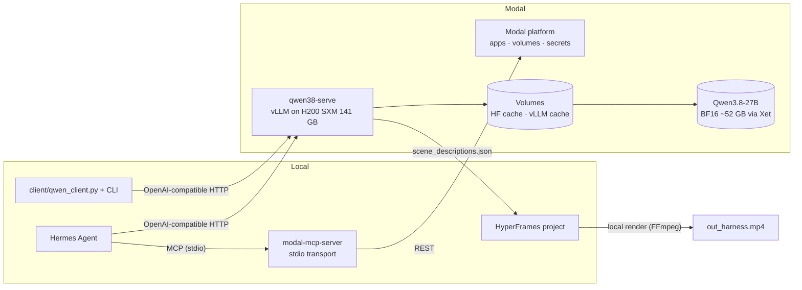

# Modal + HyperFrames + Hermes Agent

Serverless **Qwen3.8-27B** (BF16, thinking mode) on **Modal H200** via vLLM, driven by **Hermes Agent** through the **Modal MCP server**, rendering **HyperFrames** videos.

The first full test — a 5–7 minute client-demo course video built from `harness-engineering/` (10 sections, 10 diagram PNGs, 10 HTML slides) — is **complete**: Qwen vision analysis at `reasoning_effort=xhigh`, a 10-clip storyboard (6:22), a beginner-paced voiceover script, and a HyperFrames composition that passes all gates (0 errors, 0 warnings, 61/61 WCAG AA).

## Status

| Task | Description | Status |
|---|---|---|
| 1 | Project scaffold (git, AGENTS.md, .env.example, .gitignore, README) | ✅ |
| 2 | Modal MCP server registered in Hermes (57 tools) | ✅ |
| 3 | Modal account state verified (profile, secret, balance) | ✅ |
| 4 | `qwen38_serve.py` — Modal vLLM server on H200 | ✅ |
| 5 | Deployed + endpoint smoke-tested (text 0.8s, vision 2.7s) | ✅ |
| 6 | Qwen client + CLI with official xhigh sampling defaults (17 tests) | ✅ |
| 7 | HyperFrames scaffold + hot-tips authoring contract | ✅ |
| 8 | Harness-engineering 5–7 min course video (full test) | ✅ |
| 9 | README + final verification pass | ✅ |

## Architecture



**Data flow for the full test:** Hermes orchestrates → Qwen3.8-27B (H200) analyzes the 10 course diagrams at `reasoning_effort=xhigh` → `harness-engineering-analysis/scene_descriptions.json` → storyboard + voiceover script → 10-clip HyperFrames composition → `npx hyperframes check` → preview → render to MP4.

## Quickstart

### 1. Deploy the endpoint

```bash
modal deploy qwen38_serve.py > logs/deploy.log 2>&1
```

First build takes 10–15 min (image + 52 GB Xet download into the volume). Redeploys are ~2s (image cached). If the app is stopped: `modal app stop qwen38-serve -y` first, then deploy.

### 2. Verify the endpoint

```bash
curl -s https://tamazightdev--qwen38-serve-qwen38server.us-east.modal.direct/v1/models
# → {"id":"Qwen/Qwen3.8-27B", ..., "max_model_len":262144, ...}

python3 scripts/smoke_serve.py --base-url https://tamazightdev--qwen38-serve-qwen38server.us-east.modal.direct/v1
```

Cold start after idle: ~3–4 min (weights volume-cached; first-ever start ~8 min). The first request triggers it — retry with a loop.

### 3. Use the client

```bash
# Text
uv run --with "openai>=1.0" python client/cli.py ask "Explain agent harnesses in one sentence"

# Vision (diagram analysis)
uv run --with "openai>=1.0" python client/cli.py ask "Describe this diagram..." --image harness-engineering/images/diagrams/sec-1-AI-Agent-System-Architecture.png

# Video
uv run --with "openai>=1.0" python client/cli.py ask "Summarize this video" --video path/to/clip.mp4
```

Official Qwen3.8-27B thinking-mode defaults are baked in: `temperature=1.0, top_p=0.95, top_k=20, min_p=0.0, presence_penalty=0.0, repetition_penalty=1.0`, `reasoning_effort=xhigh` (override with `--reasoning-effort medium|low`, disable thinking with `--no-thinking`).

### 4. Run tests

```bash
uv run --with "openai>=1.0" --with "pytest>=8" python -m pytest tests/ -v   # 17 passed
```

### 5. HyperFrames composition

```bash
cd hyperframes
npx --yes hyperframes@0.7.109 check      # gate: 0 errors, 0 warnings, 61/61 WCAG AA
npx --yes hyperframes@0.7.109 preview    # visual review (hand URL to user)
npx --yes hyperframes@0.7.109 render --quality draft --output ../out_harness_draft.mp4
npx --yes hyperframes@0.7.109 render --quality high --output ../out_harness.mp4
ffprobe -v error -show_format ../out_harness.mp4   # duration 5:00–7:00
```

**Never render without user approval of the preview.** The CLI is pinned at `0.7.109` — always use `npx --yes hyperframes@0.7.109 <command>` or the npm scripts in `hyperframes/package.json`.

### 6. Voiceover sync (after the user records)

Per `hyperframes/HYPERFRAMES_HOT_TIPS.md` Audio Sync Workflow: note actual timestamps from the recording, update `data-start`/`data-duration` on clips, add `<audio id="bg-audio" src="assets/voiceover.mp3" data-start="0" data-duration="<total>" preload="auto">`, re-render.

## Verified environment (2026-08-17)

| Item | Value |
|---|---|
| Modal CLI | 1.5.2 |
| Modal profile | tamazightdev |
| Modal secrets | huggingface-token ✓ |
| Modal MCP | ✓ enabled — 57 tools (`uv --directory ~/Desktop/modal-mcp-server`) |
| Model | Qwen/Qwen3.8-27B (27B, BF16 ~52 GB, 262,144 ctx, vision-enabled) |
| GPU | H200 SXM (141 GB, 4.8 TB/s, FP8) |
| Storage | Modal Volumes (1 TiB free, then $0.09/GiB/mo) |
| HF transfer | Xet (hf_xet, `HF_XET_HIGH_PERFORMANCE=1`) |
| vLLM image | `vllm/vllm-openai:qwen38` (pre-built, deps matched) |
| Node / FFmpeg | v24.16.0 / 8.1.1 |
| HyperFrames CLI | pinned `0.7.109` |

## Endpoint (live)

- **URL:** `https://tamazightdev--qwen38-serve-qwen38server.us-east.modal.direct`
- **Model:** `Qwen/Qwen3.8-27B` (BF16, 262,144 context, vision-enabled)
- **GPU:** H200 SXM (141 GB)
- **Cold start:** ~3–4 min warm (volume-cached) / ~8 min first-ever (52 GB Xet download + torch.compile + CUDA graphs)
- **Warm requests:** <3s text, <3s vision
- **Auto-scaling:** containers spin down after 15 min idle (`scaledown_window`); first request after idle triggers cold start

## Costs (2026-08-17)

| Item | Rate | Spent |
|---|---|---|
| H200 SXM GPU | $4.54/hr ($0.001261/s) | ~$4.59 (3 deploys + smoke tests + 12-diagram xhigh vision analysis) |
| Memory / CPU | included with GPU | ~$0.09 |
| **qwen38-serve total (this month)** | | **~$4.68** |
| Modal Volumes | 1 TiB free, then $0.09/GiB/mo | $0.00 (well under 1 TiB) |
| Local HyperFrames render | free (FFmpeg) | $0.00 |

The full test (12 diagram analyses at `reasoning_effort=xhigh` on the warm endpoint) cost well under $2 of the total. Modal balance: $30.00 (user-confirmed 2026-08-17).

## Harness-engineering full test results

| Artifact | Location | Status |
|---|---|---|
| Qwen vision analysis (12 diagrams, xhigh) | `harness-engineering-analysis/scene_descriptions.json` | ✅ 12 entries, sections 1–10 |
| Storyboard (10 clips, 382s = 6:22) | `hyperframes/STORYBOARD.md` | ✅ within 5–7 min target |
| Voiceover script (beginner-paced, 130–150 wpm) | `hyperframes/VOICEOVER_SCRIPT.md` | ✅ all clips verified |
| Composition (525 lines) | `hyperframes/index.html` + `styles/main.css` + `anim.js` | ✅ `check` passes |
| Composition gates | `npx hyperframes@0.7.109 check` | ✅ 0 errors, 0 warnings, 61/61 WCAG AA |
| Client unit tests | `tests/` | ✅ 17 passed |
| Endpoint | `/v1/models` | ✅ `Qwen/Qwen3.8-27B`, 262,144 ctx |

**Clip timing:** 10 clips × 38–40s, sequential `data-start`/`data-duration` on track 1, root `data-duration=382`. Design system: `#090d16` slate gradient, Inter + JetBrains Mono, glassmorphism cards, electric accents (Cyan/Emerald/Amber/Ruby/Purple), brick-snapping diagram nodes, glowing SVG connectors, timeline progress bars. Pacing follows the hot-tips minimums (badge 0.7s, subtitle 1.8s, Two-Card Rule 8–10s, bullets 1.5s, diagram nodes 5s, code lines 0.8s, callout in last 10–12s).

**Remaining (requires user):** preview approval → user records voiceover → audio sync → render draft → render high quality.

## Troubleshooting

| Symptom | Fix |
|---|---|
| `TypeError: The @app.server() decorator must be used on a class.` | Modal 1.5.2 requires class-based `@app.server()` — see `qwen38_serve.py` |
| `Error: No such command 'validate'` | Validate locally: `uv run --with "modal>=1.5.2,<1.6" python -c "import qwen38_serve"` |
| `Error: No such command 'quota'` | Use `modal billing report --for "this month" --show-resources` |
| `hermes mcp add` cancels in scripts | Pipe `Y`: `echo "Y" \| hermes mcp add ...` |
| `--env` values land in `args` after `hermes mcp add` | Move them into an `env:` block in `~/.hermes/config.yaml` via a Python yaml script |
| `vllm: error: unrecognized arguments: --temperature` | Sampling params are request-time, not server flags — remove from `vllm serve` command |
| `Completions.create() got an unexpected keyword argument 'top_k'` | OpenAI SDK doesn't accept top_k/min_p/repetition_penalty as direct params — move to `extra_body={}` |
| `uv run --with "openai>=1.x"` parse error | Use `openai>=1.0` (PEP 440 doesn't accept `1.x`) |
| `torchvision/transforms/v2` import crash | Use `vllm/vllm-openai:qwen38` pre-built image instead of pip-installing vLLM on a bare CUDA image |
| `TimeoutError: vLLM did not become healthy in time` | Increase `_wait_ready` timeout to 900s + `startup_timeout=20*MINUTES` for 52 GB model cold start |
| `503 "no upstreams available"` after redeploy | `modal app stop <name> -y` before redeploying to force a fresh container |
| `proc.wait()` blocks container readiness | Don't call `proc.wait()` in `@modal.enter()` — vLLM runs in background; add `@modal.exit()` cleanup instead |
| `{"error":"no upstreams available"}` on first request | Normal — container scaled down after 15 min idle. Retry in a loop; cold start ~3–4 min (volume-cached) |
| `timeout: command not found` (macOS) | Use Python deadline loops (`urllib` + `time.time()`) or `gtimeout` (coreutils) |

## Project structure

```
qwen38_serve.py          # Modal vLLM server (H200, Xet, volumes, class-based @app.server)
client/                  # OpenAI-compatible Qwen client + CLI (official xhigh defaults)
scripts/                 # smoke_serve.py, analyze_scene.py
hyperframes/             # HyperFrames project (HYPERFRAMES_HOT_TIPS.md = authoring contract)
harness-engineering/     # READ-ONLY input for the full test (course, diagrams, slides)
harness-engineering-analysis/  # Qwen vision output (scene_descriptions.json)
tests/                   # 17 client unit tests
logs/                    # gitignored; modal run output
```

## Key conventions

- **Never commit `.env` or any token.** CLI auth via `~/.modal.toml`; HF token lives in the `huggingface-token` Modal secret.
- **GPU jobs:** `background=true, notify_on_complete=true`, log to `logs/`, never poll.
- **`harness-engineering/` is read-only input** — never modify.
- **Xet is the HF transfer backend** (LFS deprecated): `HF_XET_HIGH_PERFORMANCE=1`.
- **`reasoning_effort=xhigh`** for all Qwen calls (user's explicit requirement).
- **Lock vLLM/huggingface_hub versions** after the first successful deploy (image-layer stability).
- **HyperFrames CLI pinned** at `0.7.109` — always `npx --yes hyperframes@0.7.109 <command>`.
